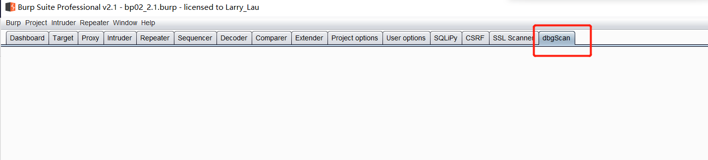

## 首先要有个接口的概念 ##

> burp 中的api 都是以接口的形式呈现，可以通过对接口的实现来实现部分功能  
> 下面我们来白编写第一个小插件  

## 在burp 目录下新建一个class 类文件 ##

    
    package burp;
    
    
    import java.awt.*;
    import java.io.PrintWriter;
    
    public class BurpExtender implements IBurpExtender ,ITab{

    private PrintWriter stdout;
    private IBurpExtenderCallbacks callbacks;

    @Override
    public void registerExtenderCallbacks(IBurpExtenderCallbacks callbacks) {
        // doing nothing
        this.callbacks=callbacks;
        callbacks.setExtensionName("dbgScan");
        callbacks.printOutput("dbgScan 加载成功");

        // get helper
        IExtensionHelpers helpers=callbacks.getHelpers();
        byte[] test=helpers.stringToBytes("hello world");
        callbacks.printOutput(test.toString());
        // obtain our output stream
        stdout = new PrintWriter(callbacks.getStdout(), true);

        callbacks.addSuiteTab(new ITab() {
            @Override
            public String getTabCaption() {
                return "dbgScan";
            }

            @Override
            public Component getUiComponent() {
                return new Component() {
                    @Override
                    public void setName(String name) {
                        super.setName(name);
                    }
                };
            }
        });

        // 插件状态监听器
        callbacks.registerExtensionStateListener(new IExtensionStateListener() {
            @Override
            public void extensionUnloaded() {
                callbacks.printOutput("dbgScan unloaded");
            }
        });
    }

    @Override
    public String getTabCaption() {
        return null;
    }

    @Override
    public Component getUiComponent() {
        return null;
    }
    }

先看一下效果，把以上代码复制到新建的文件，通过手工加载插件的方式就编写好了第一个插件

可以看到我们的插件已经线上在界面了，很高兴吧，第一个插件就是这么简单

接下来，我们看一下这几行代码做了哪些事情

首先实现了两个接口   IBurpExtender ,ITab

第一个暂时不用管，编写插件默认需要实现的一个接口  
第二个就是我们这里使用到的了，一个 Tab 的接口 ，继承这个接口，实现相应的方法之后就可以在UI 界面上添加一个Tab 

**ITab 中具体的方法接口如下，保持空实现即可   **

	@Override
    public String getTabCaption() {
        return null;
    }

    @Override
    public Component getUiComponent() {
        return null;
    }

**关键代码是下面这几行，主要作用：添加一个tab、设置tab 的名称“dbgScan”**

	callbacks.addSuiteTab(new ITab() {
            @Override
            public String getTabCaption() {
                return "dbgScan";
            }

            @Override
            public Component getUiComponent() {
                return new Component() {
                    @Override
                    public void setName(String name) {
                        super.setName(name);
                    }
                };
            }
        });

## 第一个插件编写至此完成，后面会继续编写其他可能用性高的插件 ##