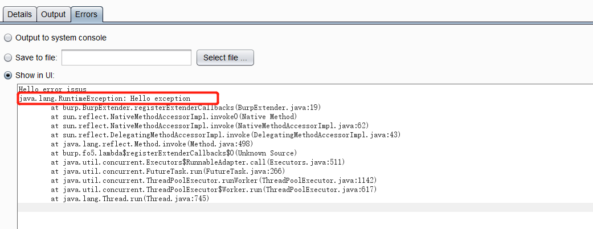

#编写第一个测试插件

入门当然要从helloword 开始了  
代码很简单，直接使用官网的入门代码即可

    package burp;

	import java.io.PrintWriter;

	public class BurpExtender implements IBurpExtender{

    @Override
    public void registerExtenderCallbacks(IBurpExtenderCallbacks callbacks) {
       callbacks.setExtensionName("Hello world extension");

        PrintWriter stdout=new PrintWriter(callbacks.getStdout(),true);
        PrintWriter stderror=new PrintWriter(callbacks.getStderr(),true);

        stdout.println("Hello output");
        stderror.println("Hello error issus");
        callbacks.issueAlert("Helllo alerts");

        throw new RuntimeException("Hello exception");

    }
	}

可以看到插件加载之后报错了，不用怕，因为我们代码的最后一句就是故意让他报错的

Helloworld 到这里就编写完成了