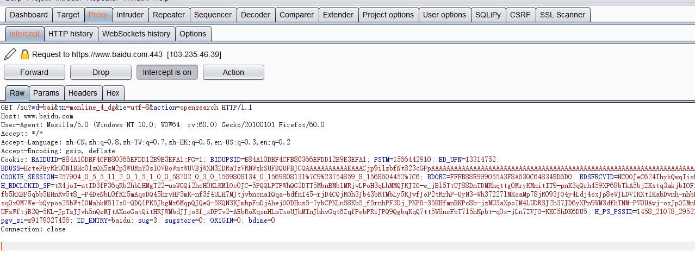
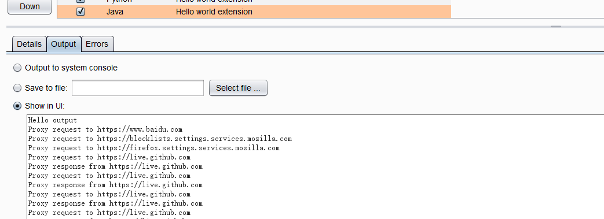

#编写EventListener 插件
在上一篇的基础上，让BurpExtender 多实现一个接口：IProxyListener  
获取proxy 相关的信息

实现这个接口需要覆盖下面这个方法  
    
	@Override
    public void processProxyMessage(boolean messageIsRequest, IInterceptedProxyMessage message) {
        stdout.println(
                (messageIsRequest?"Proxy request to ":"Proxy response from ")+
                        message.getMessageInfo().getHttpService()
        );
    }

上面代码意思：判断当前信息是否为request 或response，然后输出对应的proxy 信息

##插件运行结果如下
首先让proxy 处于拦截状态

然后查看插件对应的输出内容

可以在输出位置看到预期的正确输出  
这个插件主要是一个Event 的监听，监听的内容就是proxy 拦截到对应的内容之后，输出对应的结果

###完整代码如下  

    package burp;

	import java.io.PrintWriter;

	public class BurpExtender implements IBurpExtender,IProxyListener{
    private PrintWriter stdout;

    @Override
    public void registerExtenderCallbacks(IBurpExtenderCallbacks callbacks) {
       callbacks.setExtensionName("Hello world extension");

        PrintWriter stdout=new PrintWriter(callbacks.getStdout(),true);
        PrintWriter stderror=new PrintWriter(callbacks.getStderr(),true);

        this.stdout=stdout;

        stdout.println("Hello output");
        stderror.println("Hello error issus");
        callbacks.issueAlert("Helllo alerts");

	//        throw  new RuntimeException("Hello exception");

        callbacks.registerProxyListener(this);

    }

    @Override
    public void processProxyMessage(boolean messageIsRequest, IInterceptedProxyMessage message) {
        stdout.println(
                (messageIsRequest?"Proxy request to ":"Proxy response from ")+
                        message.getMessageInfo().getHttpService()
        );
    }
	}

